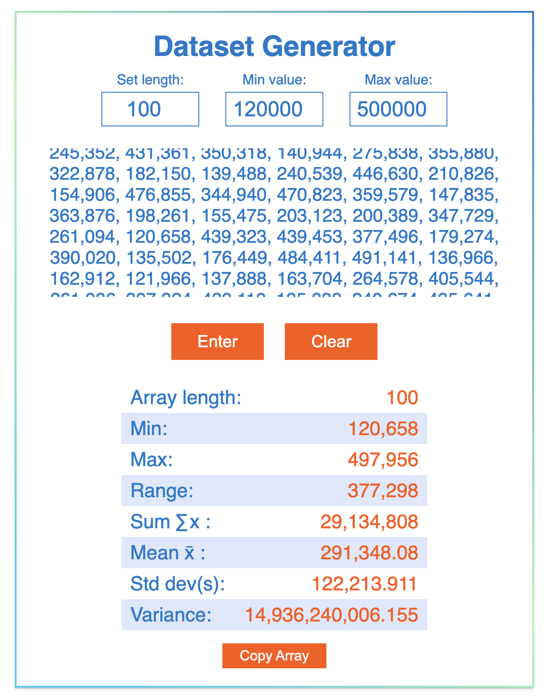

## Array Generator

The Integer Array Generator app allows users to effortlessly create random integer arrays tailored to their specifications. Simply input the desired array length, along with minimum and maximum values, and the app will generate an array filled with integers that meet your criteria. Ideal for developers, educators, and anyone needing quick data for testing or analysis, this intuitive tool provides options for customization, ensuring you get exactly the array you need in seconds. Whether for programming exercises, simulations, or statistical projects, the Integer Array Generator streamlines the process of generating random data.

